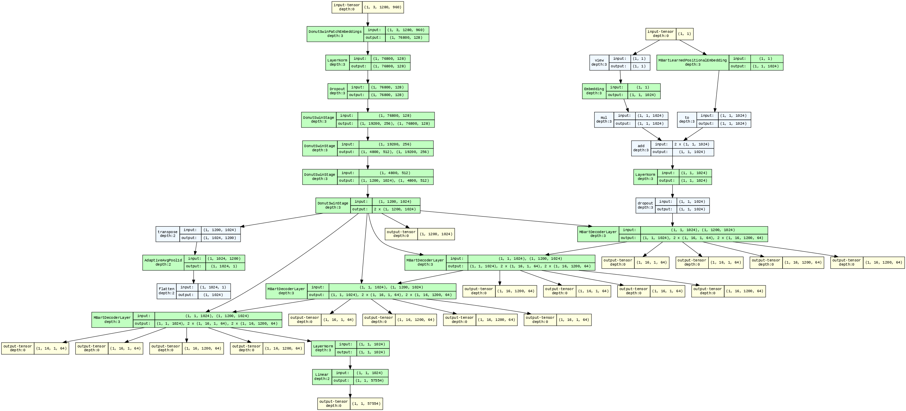

# Fabric-Composition-Extraction by Fine-Tuning DONUT on custom dataset
Github repo for Fine-Tuning DONUT on self collected dataset

- To fine-tune our model on a custom dataset, first clone the repo and then create a Hugging Face Image Dataset Apache Arrow object by creating the required environment by running:
[create_environment.sh](https://github.com/azhara001/Fabric-Composition-Extraction/blob/main/create_environment.sh)

- Next, run the following:
[dataset_prep.py](https://github.com/azhara001/Fabric-Composition-Extraction/blob/main/dataset_prep.py)

- To fine-tune the model on your own dataset, run the following:
[Fine_Tuning_DONUT.ipynb](https://github.com/azhara001/Fabric-Composition-Extraction/blob/main/Fine_Tuning_DONUT.ipynb)

  - Note: This notebook draws major inspiration from ([https://github.com/NielsRogge/Transformers-Tutorials/tree/master/Donut)[https://github.com/NielsRogge/Transformers-Tutorials/tree/master/Donut]

